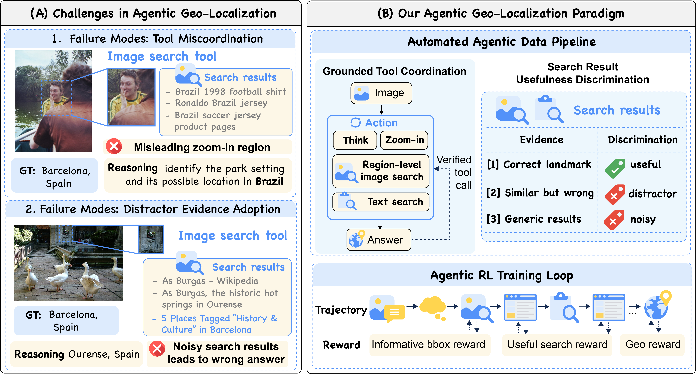
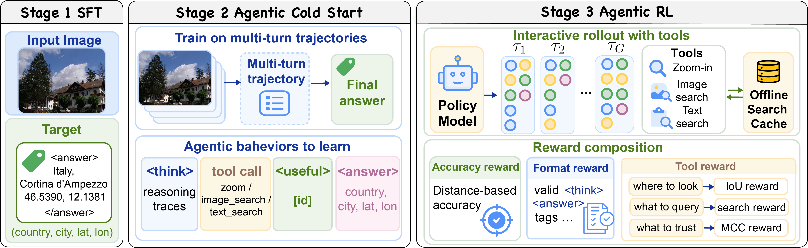
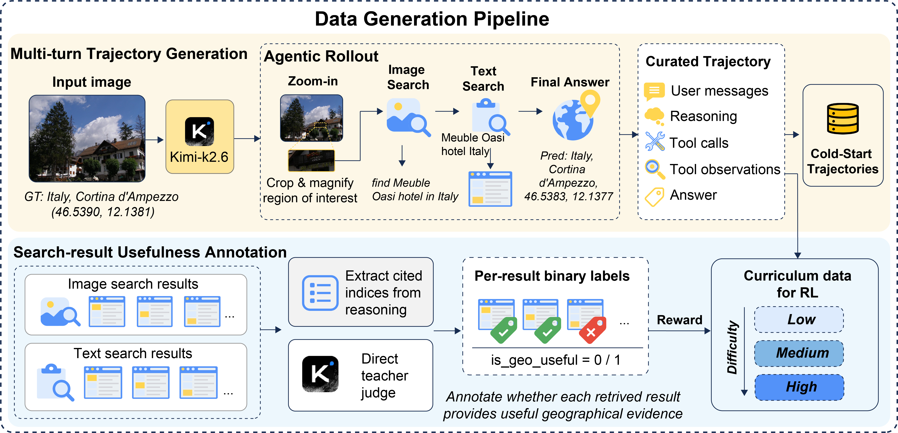
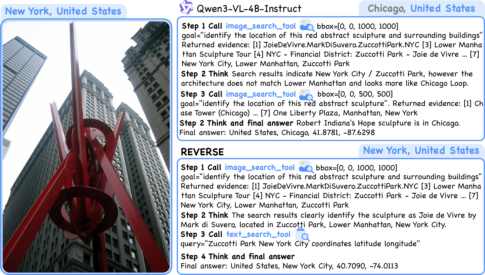

# REVERSE** (**R**einforcing **E**vidence **Ver**ification and **Se**arch for Agentic Image Geolocation)

[Paper Link (arXiv:2605.26861)](https://arxiv.org/abs/2605.26861)

The model learns to iteratively zoom into image regions, search with image crops, and query text search engines — then synthesizes evidence to predict GPS coordinates.


*(A) Agentic geo-localization fails when a model crops the wrong region and follows misleading results, or retrieves the right candidate but cannot filter distractors. (B) REVERSE fixes both: spatial [...]

---

## Overview

```
REVERSE/
├── eval/               # Evaluation pipeline (Im2GPS3k, YFCC4k)
├── data_pipeline/      # Data processing: SFT coldstart + RL parquet builders
├── script/
│   ├── sft/            # SFT training scripts
│   └── rl/             # RL training scripts (GRPO, configs, dist launcher)
└── verl/               # Full verl with modifications for relative image paths
                        # and offline search cache support
```

---

## Environment

We use the official verl Docker image:

```bash
docker pull verlai/verl:sgl056.latest
```

Install verl from this repo:

```bash
cd verl
pip install --no-deps --no-build-isolation -e .
pip install --no-deps fastmcp
```

---

## Dataset

The dataset is hosted on HuggingFace: **[Jack11211/REVERSE](https://huggingface.co/datasets/Jack11211/REVERSE)**

Download and set `DATA_ROOT`:

```bash
export DATA_ROOT=/path/to/REVERSE_data
```

Expected structure:
```
$DATA_ROOT/
├── images/          # All training images (relative path root)
├── sft/             # SFT coldstart parquet files
│   ├── train_sft_coldstart_v5.parquet
│   └── val_sft_coldstart_v5.parquet
├── rl/              # RL training parquet files
│   ├── train_rl_v5_easy.parquet
│   ├── train_rl_v5_full.parquet
│   └── val_rl.parquet
└── rl_cache/        # Offline search cache (image_search + text_search)
    ├── image_search_cache.parquet
    └── text_search_cache.parquet
```

---

## Training


*REVERSE training pipeline: direct SFT → cold-start multi-turn SFT → agentic RL with offline search cache and process-level rewards.*


*Data pipeline: Kimi-K2.6 generates trajectories over MP-16 Pro images, filtered for quality, annotated with evidence labels and corrected bounding boxes, then split into easy/full curriculum.*

### Stage 1: SFT on MP-16 Pro (~4M images)

Geographic knowledge pretraining on the MP-16 Pro dataset.

```bash
DATA_ROOT=/path/to/REVERSE_data \
bash script/sft/dist/run_sft_dist.sh
```

### Stage 2: SFT Coldstart (multi-turn tool-use)

Trains the model on cold-start trajectories with zoom, image search, and text search tools.

```bash
DATA_ROOT=/path/to/REVERSE_data \
bash script/sft/dist/run_sft_coldstart.sh
```

### Stage 3a: RL Training (Easy curriculum)

```bash
DATA_ROOT=/path/to/REVERSE_data \
TRAIN_FILE=train_rl_v5_easy.parquet \
TRAIN_SCRIPT=/path/to/REVERSE/script/rl/geoloc/run_qwen3vl-4b_geoloc_coldstart_v5_dist.sh \
bash script/rl/dist/run_dist.sh
```

### Stage 3b: RL Training (Full curriculum)

```bash
DATA_ROOT=/path/to/REVERSE_data \
TRAIN_FILE=train_rl_v5_full.parquet \
MODEL_PATH=/path/to/stage3a_checkpoint/huggingface \
TRAIN_SCRIPT=/path/to/REVERSE/script/rl/geoloc/run_qwen3vl-4b_geoloc_coldstart_v5_dist.sh \
bash script/rl/dist/run_dist.sh
```

---

## Evaluation

```bash
cd eval/
python eval_benchmark.py \
    --model_path /path/to/checkpoint \
    --data_root $DATA_ROOT
```


*Comparison of two agent trajectories on the same case. Qwen3-VL-4B-Instruct retrieves strong evidence but rejects it and follows a distractor. REVERSE correctly identifies the sculpture and predicts [...]

---

## Environment Variables

| Variable | Description |
|---|---|
| `DATA_ROOT` | Path to dataset root (images + parquet files) |
| `WANDB_API_KEY` | Weights & Biases API key |
| `OXYLABS_USER` | Oxylabs username (for live image search) |
| `OXYLABS_PASS` | Oxylabs password |
| `TAVILY_API_KEY` | Tavily API key (optional, for live text search) |
| `COS_SECRET_ID` | Tencent COS secret ID (optional, for image upload) |
| `COS_SECRET_KEY` | Tencent COS secret key (optional, for image upload) |

> For offline training with precomputed cache, only `DATA_ROOT` and `WANDB_API_KEY` are required.

---

## Citation

If you find our work useful, please cite:

```bibtex
@misc{li2026reverse,
  title   = {REVERSE: Reinforcing Evidence Verification and Search for Agentic Image geo-localization},
  author  = {Yong Li and Furong Jia and Dacheng Yin and Kang Rong and Fengyun Rao and Jing Lyu and Fan Zhang},
  year    = {2026},
  archivePrefix = {arXiv},
  eprint  = {2605.26861}
}
```
